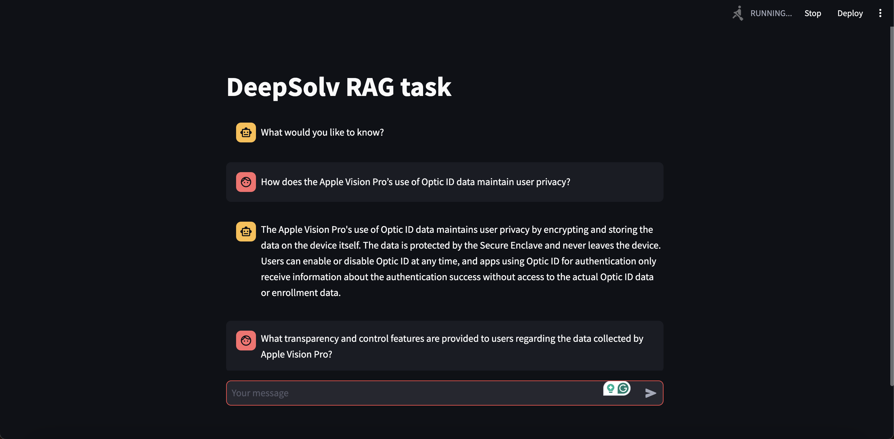

<!DOCTYPE html>
<html lang="en">
<head>
    <meta charset="UTF-8">
    <meta name="viewport" content="width=device-width, initial-scale=1.0">
</head>
<body>
    <h1>DeepSolv RAG Project 🚀</h1>
    <h2>Overview 📝</h2>
    
This project implements a Retrieval-Augmented Generation (RAG) system with a focus on handling unstructured data and providing a user-friendly interface.

    <h2>Implementation Details 🔧</h2>
    <ol>
        <li><strong>RAG Implementation:</strong>
            <ul>
                <li>Language Model: Utilized OpenAI's GPT-3.5 turbo as the LLM for generating responses. 🤖</li>
                <li>RAG Framework: Leveraged LlamaIndex to integrate and retrieve relevant information. 📚</li>
            </ul>
        </li>
        <li><strong>Unstructured Data Handling:</strong>
            <ul>
                <li>PDF Data Extraction: Implemented RAG on data extracted from a PDF document titled <em>"Apple Vision Pro Privacy Overview"</em>. This involved parsing and processing the document to create a structured knowledge base. 📄</li>
            </ul>
        </li>
        <li><strong>Web Scraping:</strong>
            <ul>
                <li>Website Data Collection: Used BeautifulSoup and LangChain to scrape data from the official Apple Vision Pro website. This data was then integrated into the RAG system to enrich the knowledge base. 🌐</li>
            </ul>
        </li>
        <li><strong>Web Interface:</strong>
            <ul>
                <li>UI Development: Created an interactive web UI using Streamlit to allow users to interact with the RAG system seamlessly. 🖥️</li>
                <li>UI Development: The chatbot is made to sound like a sales agent who is pursuasive and tries to get the user to buy the product 🖥️</li>
            </ul>
        </li>
    </ol>
    <h2>Final Submission 🎯</h2>
    <ul>
        <li>Code Repository: <a href="https://github.com/soodaryan/DeepSolv-RAG-Task">Link to GitHub repository</a></li>
        <li>Video Recording: click on the image to view demo
<!--          -->
            <a href = "https://drive.google.com/file/d/1mh2Uk5sNHmLXRD38QyjsIWVQfJADKGcN/view?usp=sharing">
                

                
            

    </li>
    </ul>
    <h2>How to Run 🏃‍♂️</h2>
    <ol>
        <li>Clone the Repository:
            <pre><code>git clone https://github.com/soodaryan/DeepSolv-RAG-Task.git
cd DeepSolv-RAG-Task</code></pre>
        </li>
        <li>Install Dependencies:
            <pre><code>pip install -r requirements.txt</code></pre>
        </li>
        <li>Run the Application:
            <pre><code>streamlit run app.py</code></pre>
        </li>
        <li>Environment Variables: Ensure you set up necessary environment variables for API keys and database connections. 🔑</li>
    </ol>
    <h2>Notes 📋</h2>
     <ul>
        <li>Create a .env file and add your OPENAI API KEY to use the chatbot.</li>
        <li>Ensure you have the required access to APIs and services used in this project.</li>
        <li>Review the <code>requirements.txt</code> for all dependencies and their versions 📜</li>
    </ul>
    <h2>Acknowledgments 🙏</h2>
    
Thanks to the open-source libraries and tools used in this project, including OpenAI, LlamaIndex, BeautifulSoup, LangChain, and Streamlit.

    <h2>License 📜</h2>
    
This project is licensed under the MIT License - see the <a href="LICENSE">LICENSE</a> file for details.

</body>
</html>
